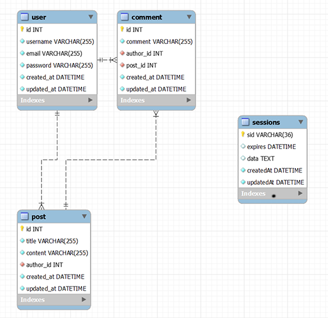
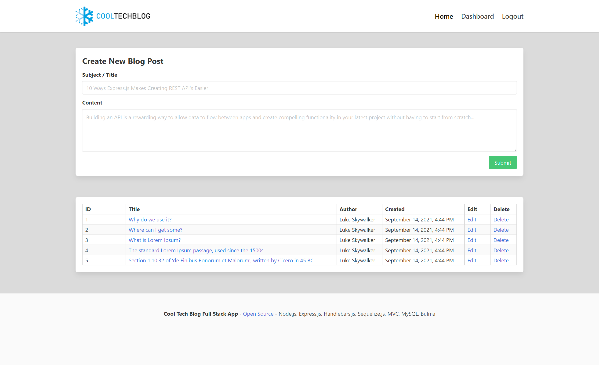
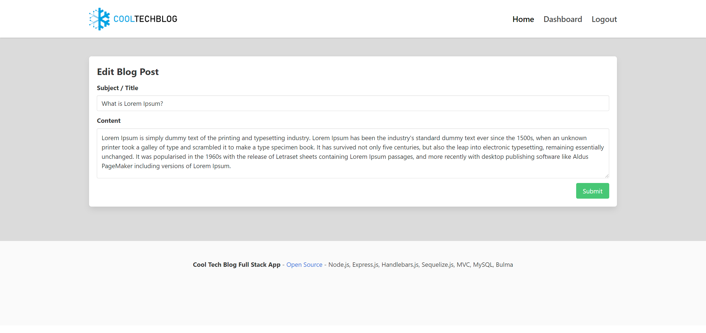
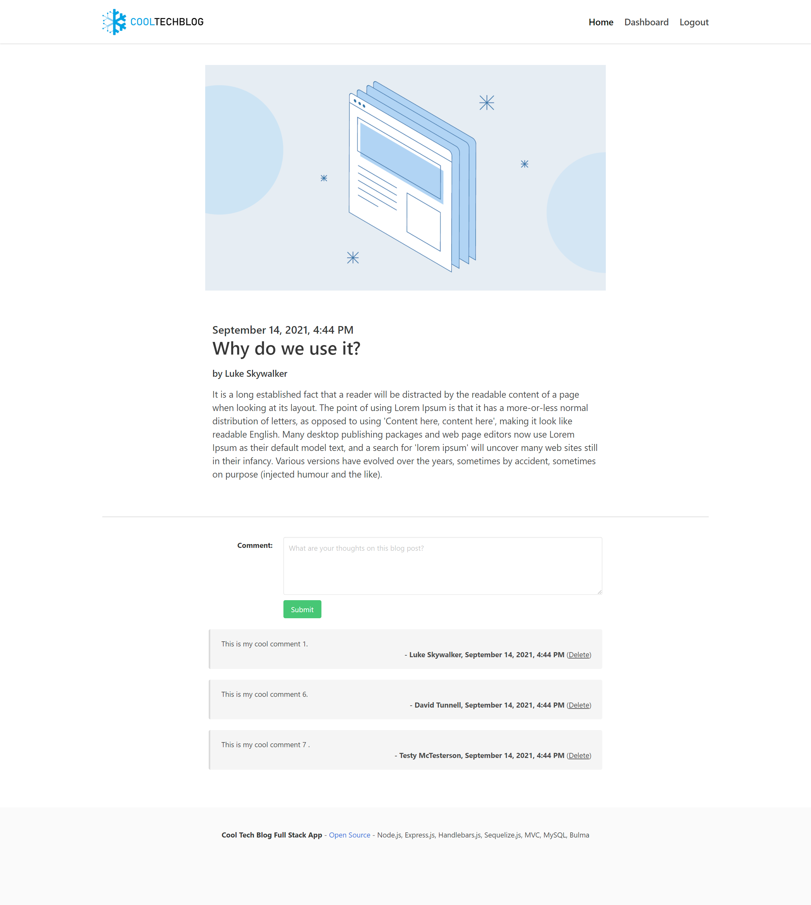
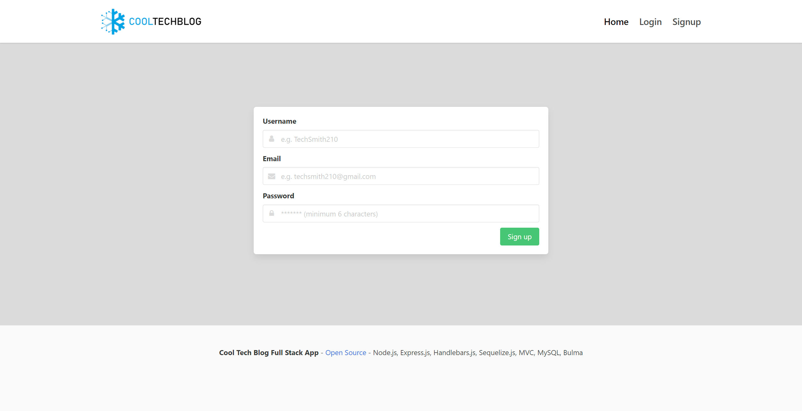
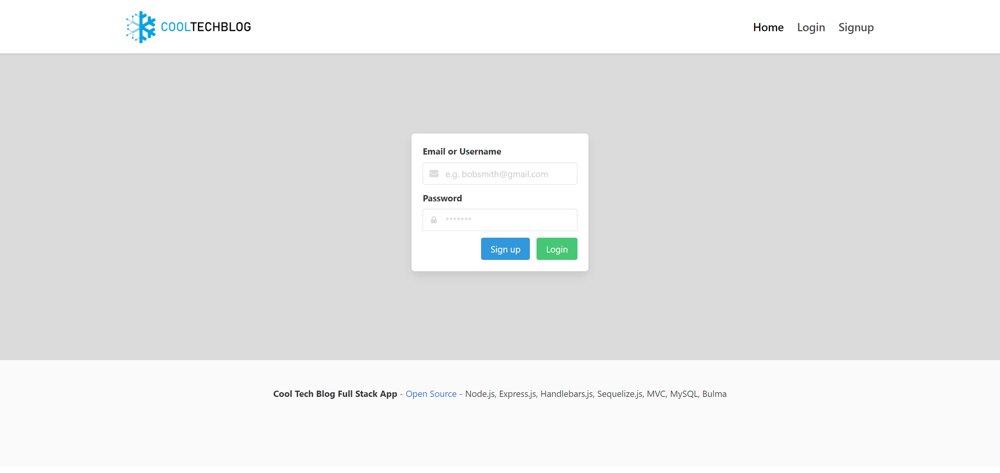
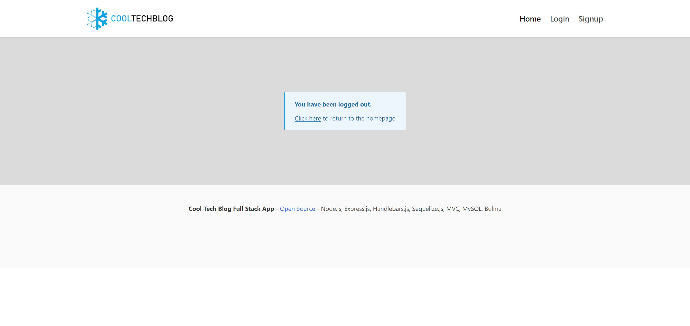

# Tech Blog - MVC, Node.js, Express.js, Handlebars.js, MySQL, Bulma

An MVC full stack blog project. [Live Demo Here](https://mighty-earth-36141.herokuapp.com/).

Example Seeded User Credentials (or create your own account):

-   username: test_test@gmail.com
-   password: 12345

Features:

-   A homepage that showcases existing blog posts.
-   A navigation bar serving express routes.
-   A dashboard to create, read, update and delete blog posts for the admin.
-   Individual pages for users to create accounts, login and logout using the site using authentication.
-   The ability for users comment on blog posts and for admins to delete them.
-   An auto timeout logout where after a certain amount of time the user will need to login again for certain actions (add, update, delete, comments).
-   Sessions and Cookie based authorization/security for parts of the application
-   Client-side API consumption and AJAX DOM manipulation.
-   An API that serves JSON via Database.
-   A Templated view engine for reusable code.
-   A Modern responsive interface design.
-   An Automated database schema generation and seed data (and a SQL script to generate the database itself).
-   A Highly Modular MVC Design for Extensibility.
-   Optional API URL Generator for external API consumption.
-   Authentication Middleware for Routing Stack.
-   Modular Layout with a Main and Partial Template Usage

This project uses the following technologies/libraries.

-   [MVC Architecture](https://en.wikipedia.org/wiki/Model%E2%80%93view%E2%80%93controller) - Designed with Extensibility in Mind (Notice the Controller Routes, Client-Side JavaScript and Handlebar Views)
-   [Node.js](https://nodejs.org/en/) and [Express.js](https://expressjs.com/) as the Server for API and HTTP requests
-   [MySQL](https://www.mysql.com/) Database Schema
-   [Sequelize.js](https://sequelize.org/) for [Object Relational Mapping](https://en.wikipedia.org/wiki/Object%E2%80%93relational_mapping), Database Interaction, [Routing](https://expressjs.com/en/guide/routing.html) and Schema Generation and Seeding
-   [Dotenv](https://www.npmjs.com/package/dotenv) for Database Connection Settings
-   [Handlebars.js](https://handlebarsjs.com/) for Dynamic View Templating and Server Side HTML Rendering
-   [Bcrypt Package](https://www.npmjs.com/package/bcrypt) for Password Hashing and Management
-   [Express-Session](https://www.npmjs.com/package/express-session) and [connect-session-sequelize](https://www.npmjs.com/package/connect-session-sequelize) for Session and Cookie Management
-   [Bulma](https://bulma.io/) and the [Blog 2 Template](https://github.com/BulmaTemplates/bulma-templates/blob/master/templates/blog-tailsaw.html) as a CSS Style Framework
-   [Nodemon](https://www.npmjs.com/package/nodemon) for Easier Server-Side Development
-   [Heroku](https://www.heroku.com) for Demo Deployment

## Project Structure

The structure was designed as rather modular for extensibility. This might be overboard for some but it is designed so this project can be used to kick off larger scale projects.

The `assets` folder just contains screenshots for this README. The `config` folder is the Sequelize connection used throughout the server side and uses dotenv for connection properties. The controllers folder holds the routing logic for the API and web app calls. The db folder just contains a script to generate the empty database that is used in this project. The models folder contains each of the models used in the MVC model and is connected to the database via Sequelize. The public folder contains css, images and JavaScript used by the client side application served to the end user's browser. This includes API calls to the RESTful API Node.js Server. This is also where the `./config/apiConfig.js` is if external API calls are needed in the future. The seeds folder contains the JavaScript and JSON to create the database tables and seed them with test data. The utils folder has several server side helpers such as the authentication middleware and a DateTime formatter for rendering in the Handlebars.js views. The views folder contains the Handlebars.js main layout template, child templates, and partials to render in those children. Finally, `./server.js` is the main file to run the server.

## Installation

First run `npm i` at the project root to get the node project dependencies and then update the file `.env.EXAMPLE` to `.env` and update it with your database credentials. If the database name `blog_db` is changed is also needs to be changed in the `./db/schema.sql` for database generation.

Then run the script to generate the `blog_db` database using the `./db/schema.sql`. Then use command `npm run seed` (notice the various commands available in `package.json`) to generate the tables and example user, post and comment data. Once this is complete use command `npm run dev` if you would like the server to use Nodemon and auto-restart when there are updates to code or `npm run start` for a normal server start.

The application will be available by default at http://localhost:3001/. The RESTful API will also be available to be called independently at http://localhost:3001/api/user/, http://localhost:3001/api/post/, http://localhost:3001/api/comment/.

## Example API Call

POST - http://localhost:3001/api/post/ - `{ "title": "Title of a Blog Post", "content": "Content of a blog post three times. Content of a blog post three times. Content of a blog post three times. ", "author_id": "1" }`

## Schema Diagram

## Screenshots

### Homepage

### Dashboard / CRUD for Posts

### Edit Post

### View Post and Comments

### Sign up

### Login

### Logout

# 
